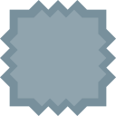

# Grid game [Development]

This repository contains part of a Godot project that is used to develop a finite state machine like game.

The game is currently under heavy restructuring and contains lot of messy code snippets.

## Outline

The game is structured in **levels**. In every level the player sees a **grid** of empty cells and an initial game level configuration (so some cells are populated with certain tiles).

The player can now add tiles by choosing them in the **tile area**. The number of tiles to add is limited on a per-level basis and controls the difficulty of the level (less tiles - harder to play).

The goal is now after starting the simulation, to maneuver all **moveable/playable** tiles to the right spot on the grid.

### Tiles

Here is a list of tiles that should currently be implemented in the game

| Name | Description | Properties | Graphic |
|------|-------------|------------|---------|
| **Empty cell** | Represents an empty spot on the grid where a tile can move | ; |  |
| **Player tile** |  Core game tile; In order to finish a level all tiles of this type need to be placed on the corresponding color spot |  Moveable; Rotatable; Destroyable; Different colors |  |
| **Color spot** | This is where the player tiles need to be placed | Stationary; Different Colors |  |
| **Rotate Right Tile** | If a moveable tiles moves to  a neighbouring spot of this tile it is rotated by 90 degree to the right | Stationary; Undestroyable |  |
| **Destroyer Tile** | If a moveable tile moves to an adjacent position it gets destroyed | Undestroyable |  |

#### Playable/Moveable tile

- **Function:** Core game tile; In order to finish a level all tiles of this type need to be placed on the corresponding color spot
  - **Abilities**:

#### Color spot

- **Function**

## Mockup

In the following you can see a rough sketch of the UI transitions and core game mechanics.

## TODO

A list of todos until the game can be considered playable

- [x] **Core mechanics**: Simple movement
- [ ] **Abstraction/Restructuring**: Structuring different tile types in different classes; Seaparating UI from mechanics
- [ ] **UI interaction**: Add buttons, panels, ... for interacting with the game 