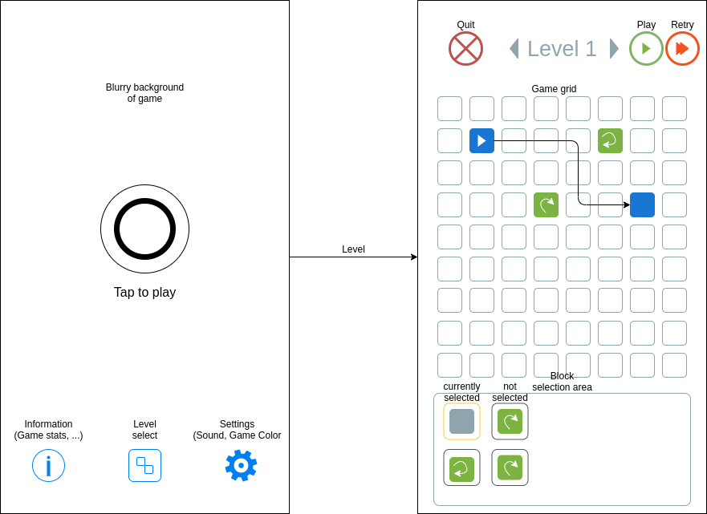

# Grid game [Development]

This repository contains part of a Godot project that is used to develop a finite state machine like game.

## Outline

The game is structured in **levels**. In every level the player sees a **grid** of empty cells and an initial game level configuration (so some cells are populated with certain tiles).

The player can now add tiles by choosing them in the **tile area**. The number of tiles to add is limited on a per-level basis and controls the difficulty of the level (less tiles - harder to play).

The goal is now after starting the simulation, to maneuver all **moveable/playable** tiles to the right spot on the grid.

## Mockup

In the following you can see a rough sketch of the UI transitions and core game mechanics.

